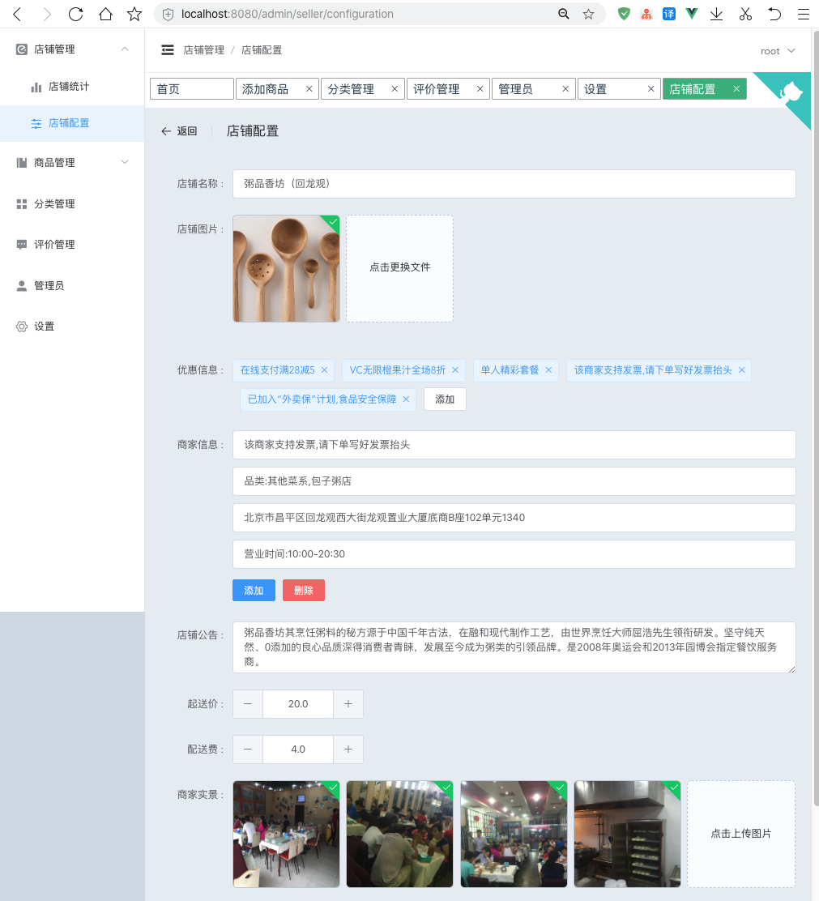

# vue-elm-admin

前端项目[vue-elm-seller](https://github.com/konglingwen94/vue-elm-seller)的配套管理后台系统

本项目主要使用`Vue`+`ElementUI`搭建而成。可以用作web端管理后台的通用模板参考使用

## 配套项目

客户端项目：<https://github.com/konglingwen94/vue-elm-seller>

服务端项目：<https://github.com/konglingwen94/elm-seller-server>
## Project setup
```
npm install
```

### Compiles and hot-reloads for development
```
npm run serve
```

### Compiles and minifies for production
```
npm run build
```

## 技术栈

本项目主要使用`element-ui`作为应用UI的组件库，使用了按需引入的配置方式，缩小了项目最终打包的体积。

其次第三方模块有`axios`,`vue-router` `v-charts`(基于echart封装的vue组件库)

## 功能

- [x] 店铺数据统计
- [x] 店铺配置
- [x] 管理员登录和退出
- [x] 商品的增删改查
- [x] 商品分类的增删改查
- [x] 评价管理
- [x] 管理员账户的密码修改
- [x] 管理员账户信息修改
- [x] 记录浏览过的页面到应用顶部标签（tab-tag）
- [x] 分等级的多管理员
- [ ] 项目整体和浏览标签优化


## 支持

## 项目截图

首页


喜欢本项目的话请您动手点一下`stat`,谢谢！
